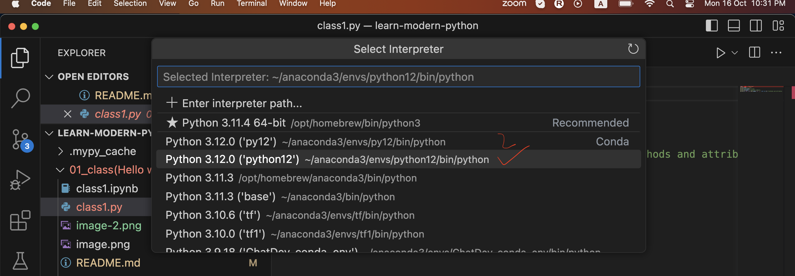

Next two weeks we learn python or data science or data analytics

Today we start from 0(zero) learn python

Python 3.12 => Modern Python (Typing + latest improvements)

Start with hello world

### Remember

TypeScript => transpile language (transpile into JavaScript)

TypeScript is a superset of JavaScript

JavaScript => interpreted language (dynamic language)

Python => dynamic language (interpreter)

Both JavaScript and Python are not compile langauge

TypeScript is a superset of JavaScript and mojo(new) is a superset of python

mojo add additional things in python and also compile

(mojo)1000 times faster then python (see in the end)

cpython(new) => compile language (talk in the next)

First of all we start moodern python(interpreted language)

### Table of Contents

* Running a "Hello World" Program

* Setting Up a Virtual Environment

# Python (interpreted language)

python => interpreted language (interpreted, compiler, transpiler)

Except install dependencies, packages, environment paths, or ides (integrade development environment)

## Anaconda

Anaconda is a distributor

### Install Anaconda

Click <a href='https://anaconda/downloads' target='_blank'>here</a> to redirect the download page of anaconda.

### Google Colab (explore)

Click <a href='https://google-colab' target='_blank'>here</a> to explore google colab.

Google colab provide cloud computing

### Back to the topic

After installaion open Anaconda prompt (black)

### Command line interface of Anaconda prompt

Then look at this,

```
(base) C:/Users>_
```

This is base environment where all packages, and something like this installed.

Type python --version or Python --version or py --version (for checking version of python).

```
(base) C:/Users>python --version
Python 3.12.7
```

This is the answer of current version of python (3.12.7).

Then write python,

```
(base) C:/Users>python
some information and three greater than symbols
>>>
```

This symbols represents acitvate the python interpreter.

Interpreter means line by line code execute.

Now you can write the print keyword and round brackets () inside this write double quotation and your name see,

```
>>>print("John")
John
```

Code is executed and the result is your name.

Then you can call the exit function,

```
>>>exit()
```

Now you are in the normal terminal,

```
(base) C:\Users>
```

Move to the directory.

```
(base) C:\Users>d:
```  

Create new folder.

```
(base) D:\>mkdir PIAIC       
```

Move to the new folder.

```
(base) D:\>cd PIAIC
```

Open vs code.

```
(base) D:\PIAIC>code .       
```

then create a file like main.py inside this write some code

open anaconda terminal move on to the same directory and run this command

```
(base) D:\PIAIC>python main.py
```

keyword python and file name with extension

In vs code add intellisence of python

## Jupyter Notebook

Create a file with the extension of jupyter notebook is .ipynb

ipynb (Interactive python nodebook)

Two options here first of code and other is markdown (for documentation)

Advance feature of jupyter notebook is execute your code in chunks

### Naming convension in Python

pep8 naming convention see <a href='https://peps.python.org/pep-0008/' target='_blank'>here</a>

### Google Colab

Move to the google colab <a href='https://google-colab' target='_blank'>click here</a> (cloud computing)

write and execute some code to the powerfull processor

### IDE's (Integrate Development Environment)

Many ide's lies like spyder, pycham (heavy), we have 50+ ide's for coding, but we selected best of the best and more useable VS Code.

### Jupyter Notebook (default)

Jupyter notebook default interface for working data science project.

## Environment or Virtual environment in Python

environment or virtual environment

base environment (by default)

create virtual environment

### Open Anaconda Prompt

Write command for create virtual environment.

```
(base) D:\PIAIC>conda create -n python12 python==3.12 -y
```

Flag -n (single hyphen -abc means a, b and c are individual searching in console or doube hyphen --version means complete word, searching as a variable)

After installation of packages, then move to this environment write command conda activate environment name.

```
(base) D:\PIAIC>conda activate python12
```

Enter, then look at this,

```
(python12) D:\PIAIC>
```

create file requirements.txt (for packages)

numpy or numpy==0.2
pandas
jupyter
mypy

### In virtual environment install packages

To installation of packages in virtual environment write command pip install -r then file name with the extension of .txt

```
(python12) D:\PIAIC>pip install -r requirements.txt
```
After installation

### Selecting the environment in vs code

Open class1.py in VS Code.

Select your virtual environment as shown below:




### Selecting the Environment in Jupyter Notebook

Open class1.ipynb in Jupyter Notebook.

Select your virtual environment as shown below:


mypy is very improtant package

Upload requirements.txt file into google colab.

See all files in your folder write command ls, like this

```
(python12) D:\PIAIC>ls
```

All files are listed

## Remember

### Installation

Anaconda

vs code

### Hello world

windows -> Anaconda prompt -> python

```
print("Hello world")
```

open VScode -> `class1.py`

```
print("Hello world")
```

install python extension

click on run button

Now let's talk about string

## String (str)

String more powerfull feature

mypy most important package

In python static type introduce

In particular variable store particular type

Old way

```
name = "Usama Israr Khan"
```

### Static Type

New or advance way

```
name: str = "Usama Israr Khan"
```

Check type errors in file write command mypy file name

```
(python12) D:\PIAIC>mypy class1.py
```

## Integers (int)

```
num: int = 700
```

## Float (float)

```
num: float = 7.0
```

## Boolean (bool)

```
flag: bool = True
```

## List (list)

```
my_list: list[str] = ['a', 'b', 'c']
```

## Tuple (tuple)

```
my_tuple: tuple[str, int, float] = ('pakistan', 7, 2.0)
```

## Any (any)

```
my_variable: any = 'Pakistan'
```
